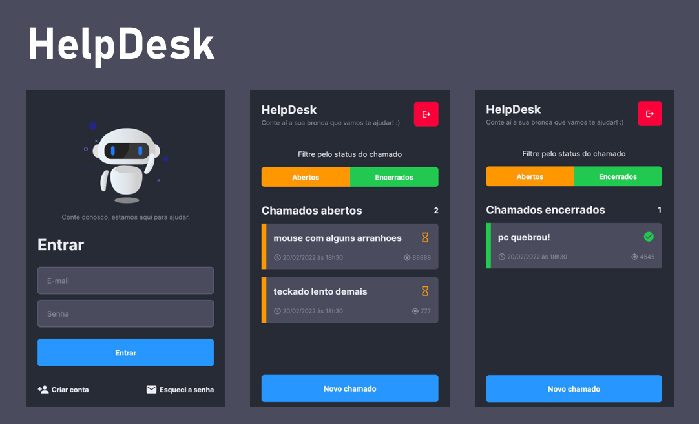

# HelpDesk

<h1 align="center">
    
</h1>

## 💻 Project

HelpDesk is a real time application to manage infra structure requests.It was built using React Native, Expo (bare flow) and Firestore as backend.

## :hammer_and_wrench: Tools and Architecture 

This project was developed using the following tools:

- [React Native](https://reactnative.dev/)
- [TypeScript](https://www.typescriptlang.org/)
- [Expo](https://expo.dev/)
- [Firebase](https://firebase.google.com/)

## :gear: How to run 

```
git clone https://github.com/debfdias/HelpDesk
cd HelpDesk
yarn install
yarn android
```

** Create a Firebase project and place the google-services.json inside your android/app folder.

Run the application in your simulator.

## 📝 License

Under MIT license.


